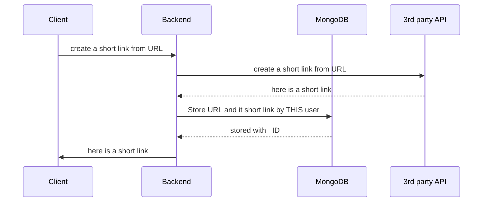
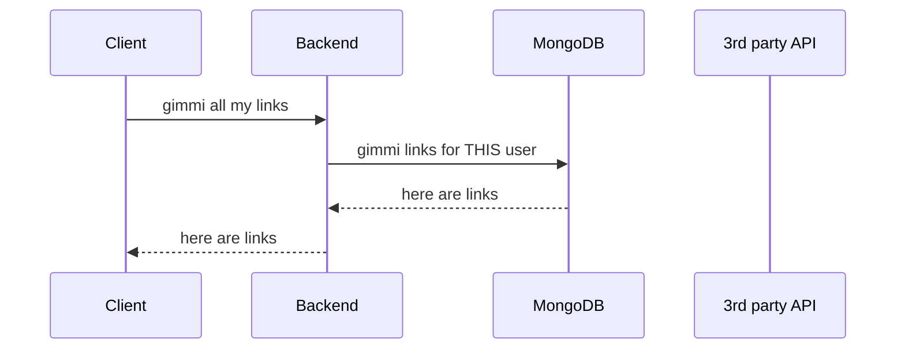
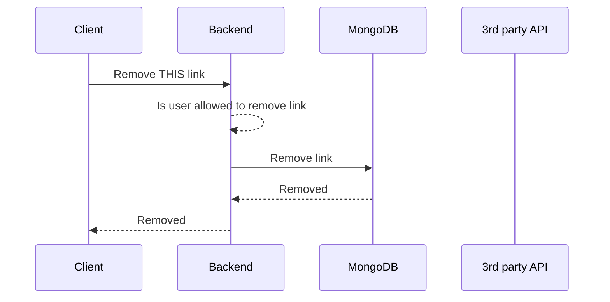

# Shortner project, BE part

3rd Party API [spoo.me](https://spoo.me)

[Alternative 3rd Parties](https://publicapis.dev/category/url-shorteners)

## Logic diagram

### Create a short link



### Get user's link



### Remove user's short link



## MongoDB setup

Start Mongo via Docker

```bash
docker run --name my-mongo -dit -p 27017:27017 --rm mongo:4.4.1
```

To run MongoDB commands in the terminal

```bash
docker exec -it my-mongo mongo
```

For MongoDB GUI use [Compass](<[https://mongodb.prakticum-team.ru/download-center/compass](https://mongodb.prakticum-team.ru/download-center/compass)>)

To stop MongoDB container

```bash
docker stop my-mongo
```
